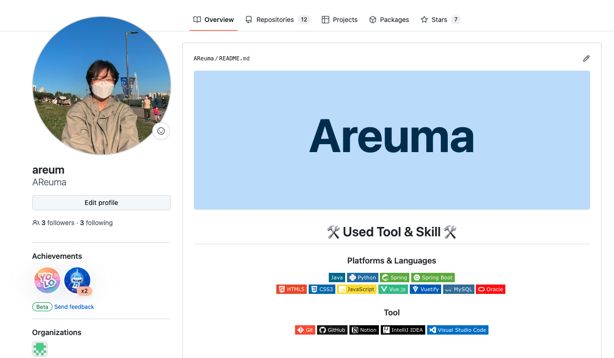
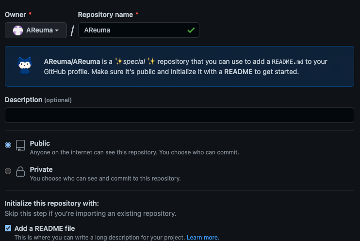
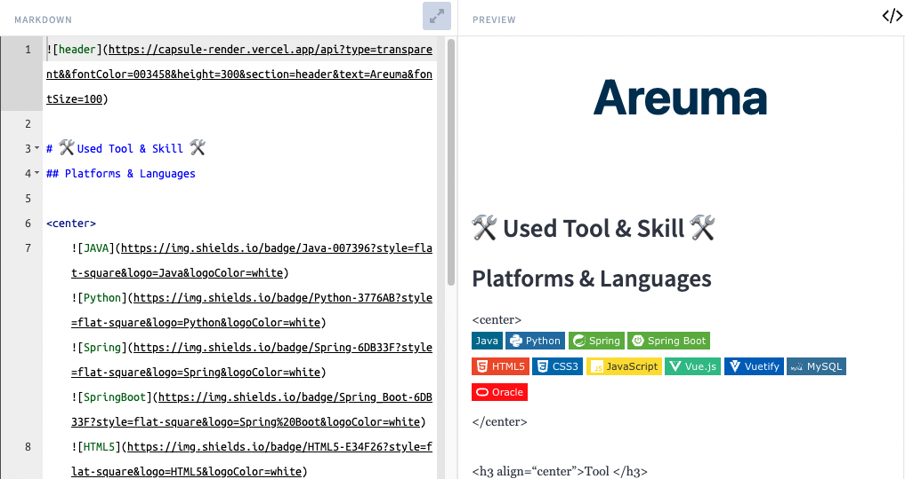
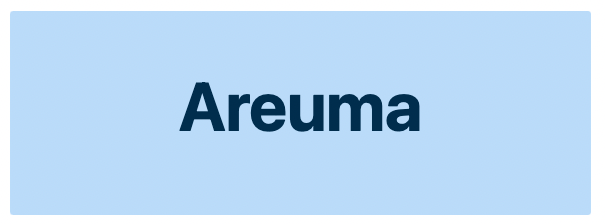
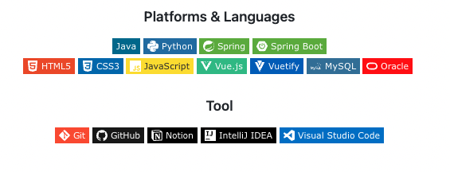
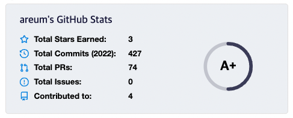
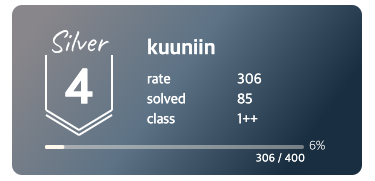
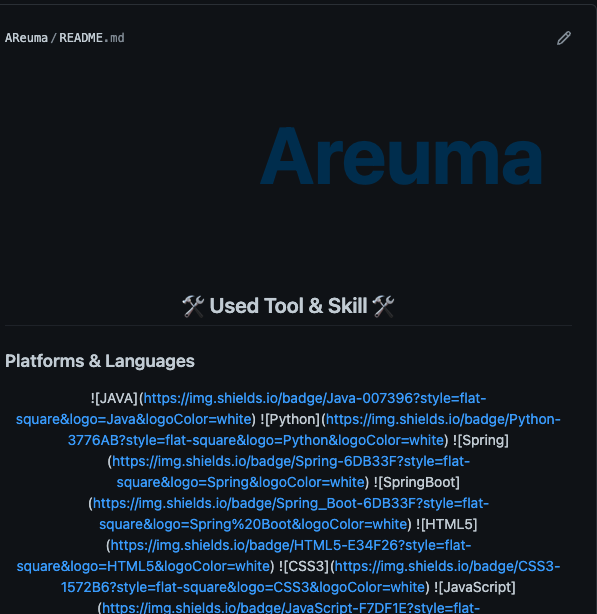

  
  
## 1. Repository 생성
  


아이디와 똑같은 이름과 똑같이 repository를 생성.  
Add a README file 선택 
  
## 2. 마크다운 내용 작성   
.md 파일 미리보기 지원하는 사이트 
[https://dillinger.io/](https://dillinger.io/) 
    



### 1. 헤더 꾸미기 
  


[https://github.com/kyechan99/capsule-render#waving](https://github.com/kyechan99/capsule-render#waving) 
  
  github에 따라서 원하는 헤더로 선택

 ~~~ html
 
 ~~~

 - 원하는 색상은 헥사코드 (아래에 들어가 원하는 색상 선택)
 ~~~
 [https://encycolorpedia.kr/00076b](https://encycolorpedia.kr/00076b)
 ~~~
  

### 2. 뱃지 
  

  
- 아이콘 
[https://simpleicons.org/?q=instarg](https://simpleicons.org/?q=instarg)
  
- 뱃지 
[https://shields.io/](https://shields.io/)


~~~ html
</a>
~~~
  
~~~ html
  
~~~

  
### 3. Github Stats
  

- github stats 페이지
[https://github.com/anuraghazra/github-readme-stats/blob/master/docs/readme_kr.md](https://github.com/anuraghazra/github-readme-stats/blob/master/docs/readme_kr.md)
  
 위의 깃허브를 따라서 github stats 설정.  
 색상도 마음대로 커스텀 가능. 

 ~~~ html
 
 ~~~

### 4. 백준 Solved.ac 
  

  

[https://github.com/mazassumnida/mazassumnida](https://github.com/mazassumnida/mazassumnida)
  

~~~ html
[](https://solved.ac/아이디/)
~~~

  
## README 오류해결 
  

  
가운데 정렬을 하기 위해서 align을 사용했으나, 마크다운 + html 사용해서 에러발생. 
  
``` html
<p align="center"> </p>
```
  
[https://www.ttmkt.com/kr/tools/markdown-to-html/](https://www.ttmkt.com/kr/tools/markdown-to-html/)  

위의 사이트에 들어가서 html을 마크다운으로 변경 후 README에 입력


  

## 완성 코드 

~~~ html


# 🛠 Used Tool & Skill 🛠
## Platforms & Languages

<center>
          
                 
</center>  

<h3 align="center">Tool </h3>
<p align="center">
     
</p>

<h1 align="center"> 🌟 Contacts 🌟 </h2>

<p align="center">
[](https://meur.tistory.com/)  [](https://twitter.com/muer_i) [](mailto:kuuniin@gmail.com)
</p>

<p>
&nbsp;&nbsp;&nbsp;[](https://solved.ac/kuuniin/) 
</p>
~~~
  
  

  
[깃허브🌱 링크](https://github.com/AReuma)