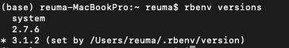
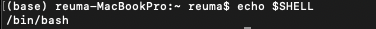
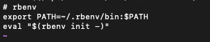

# Jekyll을 이용해서 Github 블로그 생성하기 
  
## 1. rebenv 설치 
``` HTTP
 brew install rbenv ruby-build
```
  
## 2. ruby 버전 확인 
``` HTTP
 rbenv versions
```
  
## 3. 설치 가능한 버전 확인 
``` HTTP
 rbenv install -l
```

가장 예전 버전인 2.6.10을 다운받았을때, BUILD FAILED 라는 문구가 뜨면서 설치가 안됨. 
 
에러 해결 검색해서 시도했지만 계속 에러가 발생. 
- https://velog.io/@pushpull7381/m1-mac-BUILD-FAILED-macOS-12.0.1-using-ruby-build-20211227-%EC%98%A4%EB%A5%98-%EC%9E%A1%EA%B8%B0
  
- https://stackoverflow.com/questions/48838498/failed-to-install-ruby-2-5-0-thru-rbenv-macos-high-sierra/48950894#48950894

이후, 가장 최근인 3.1.2 버전 설치했을때, 제대로 설치가됨.

## 4. 루비 설치 
``` HTTP
 rbenv install 3.1.2
```
``` HTTP
 rbenv global 3.1.2
```
#### 1) 설치한 루비 버전 확인 
``` HTTP
 rbenv versions
```

    *버전만 나올 경우 다시 설치 


## 5. 터미널 설정 변경  

#### 1) 사용하는 SHELL 검색  

  
  

    * /bin/bash 를 사용하기 때무네 bash 파일 변경 
  
#### 2) bash 파일 오픈
~~~
 vi ~/.bash_profile     
~~~
    
#### 3) 맨 밑에 아래의 명령어 추가  

  

``` HTTP
 export PATH={$Home}/.rbenv/bin:$PATH && \
 eval "$(rbenv init -)"
```
  
#### 4) 변경된 파일 적용 
``` HTTP
 source ~/.bash_profile
```

## 6. Jekyll 다운로드 
``` HTTP
 gem install bundler 
```
``` HTTP
 gem install jekyll 
```
