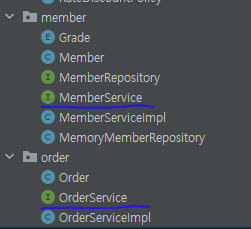
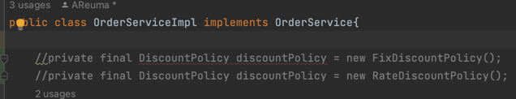
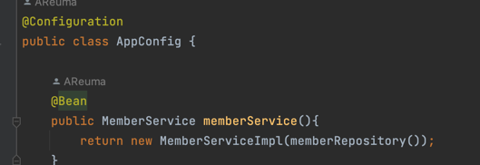
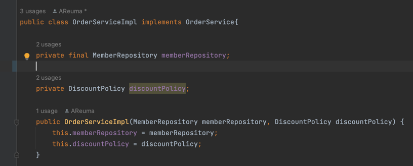

# DIP와 OCP를 준수하는 법
  

## 1. OCP와 DIP

### OCP - 개방-폐쇄 원칙 (Open/closed principle)

“소프트웨어 요소는 확장에는 열려 있으나 변경에는 닫혀 있어야 한다.”

### DIP - 의존관계 역전 원칙 (Dependency inversion principle)

프로그래머는 “추상화에 의존해야지, 구체화에 의존하면 안된다.”의존성 주입은 이 원칙을 따르는 방법 중 하나다.
  
  
MemberService와 OrderService를 인터페이스로 구현해 다형성, 역활과 구현을 확실하게 구분함.  

  
다형성을 잘 지켜서 코드를 작성했음에도 불구하고 할인 정책이 변경이 될 경우 클라이언트의 값을 변경해야함.  
<mark style="background-color: skyblue">OCP 위반함</mark>
  
변경할때 DiscountPolicy만 알아야하는게 아니라, FixDiscountPolicy가 무엇인지, RateDiscountPolicy가 무엇인지 알아야함.  
추상(인터페이스)에만 의존하는것이 아니라 구체(구현)클래스에도 의존하고 있기때문에  
<mark style="background-color: skyblue">DIP 위반함</mark>

## 2. OCP와 DIP 준수하기 
  
누군가가 클라이언트에(OrderServiceImpl)에 DiscountPolicy의 구현 객체를 생성 후 주입  
  
> 배우와 공연기획자의 책임을 확실하게 분리
> 배우를 지정하는 책임자 : 공연 기획자 
  
  
구현 객체를 생성하고, 연결하는 책임을 가지는 별도의 설정 클래스 생성
-> AppConfig

AppConfig가 아래 두개의 구현 객체를 생성.  
  * MemberServiceImpl
  * MemoryMemberRepository 

  

MemberServiceImpl에 MemoryMemberRepoitory를 생성자를 통해 주입함.  
  
MemberServiceImpl은 이제 MemberRepository 인터페이스에만 의존.  
의존관계에 대한 고민은 외부(AppConfig)에 맡기고 실행에만 집중.  
  
## 3. DI: 의존성 주입 
  
새로운 클래스를 만들어서 외부에서 구현 객체를 연결/ 주입하는것을 의존성 주입이라고함.  
  
## 4. IoC: 제어의 역전
  
AppConfig처럼 객체를 생성하고 관리하면서 의존관계를 연결해주는것.  
프로그램의 제어 흐름을 직접 제어하는 것이 아니라 외부에서 관리하는 것을 말함.  

## 5. 프레임워크 vs 라이브러리  
  
* 프레임워크는 내가 작성한 코드를 제어하고, 대신 실행되는것. (JUnit)  
* 라이브러리는 내가 작성한 코드가 직접 제어의 흐름을 담당한것.  
